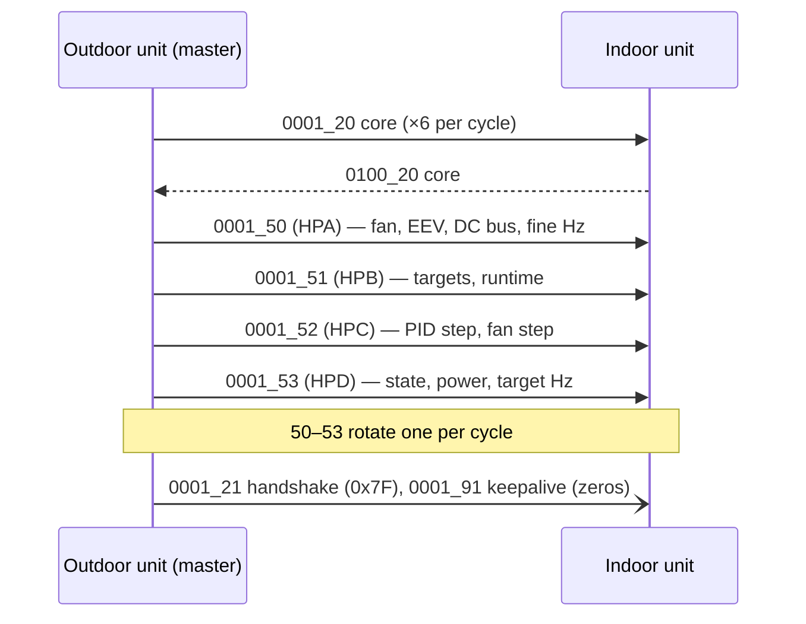
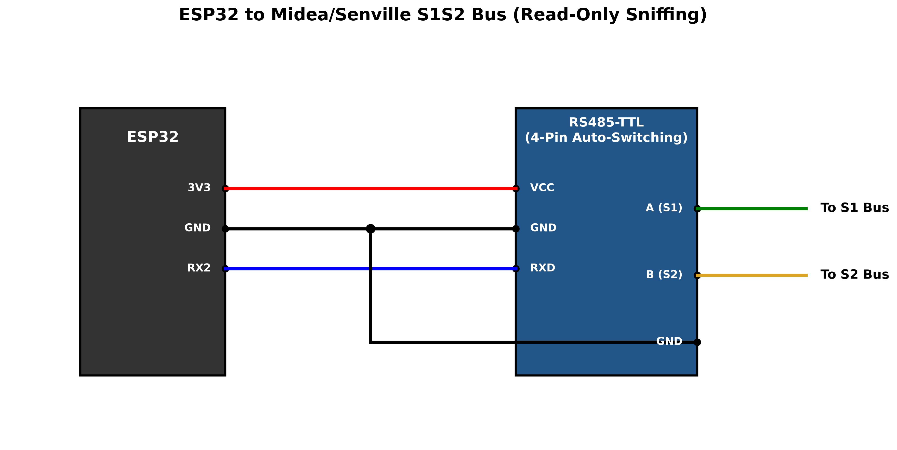

# Midea S1/S2 Bus Protocol

**A reverse-engineered reference for the RS-485 S1/S2 bus between a Midea indoor unit and its outdoor inverter unit — plus an ESPHome component that passively decodes it into Home Assistant.**

The outdoor unit (ODU) is the bus master. It continuously exchanges frames with the indoor unit (IDU), and those frames carry the whole inverter conversation: compressor frequency, temperatures, current, EXV position, fan speeds, runtime and protection state. An [ESPHome](https://esphome.io/) component on a single ESP32 listens to the bus **read-only**, decodes both sides, and publishes to Home Assistant over the native API — while streaming every raw frame to MQTT for archiving and byte-level work.

> [!NOTE]
> Unofficial and not affiliated with Midea. Everything here was measured on the system described below. Each field carries a confidence tag — treat anything not tagged ✅ as a lead, not a fact. This project is **observation-only**: it never transmits on the bus.

> [!WARNING]
> **Measure S1/S2 bus voltage before connecting anything.** On this system, where the IDU and ODU have **separate mains supplies**, S1/S2 is a ~5 V signalling pair. Many mini-splits that **share a supply** run this bus at far higher, hazardous potentials on the same terminals. Never assume — measure on your own unit, every time.

**Tested on:** Senville (Midea OEM) 3-ton central/ducted inverter heat pump.

---

## Contents

1. [At a glance](#at-a-glance)
2. [Physical layer](#1-physical-layer)
3. [Frame format and integrity](#2-frame-format-and-integrity)
4. [Who talks when](#3-who-talks-when)
5. [Frame catalogue](#4-frame-catalogue)
6. [Field maps (every byte)](#5-field-maps)
7. [Hardware](#6-hardware)
8. [Installation (ESPHome)](#7-installation-esphome)
9. [Archiving](#8-archiving)
10. [Method, sources and confidence](#9-method-sources-and-confidence)
11. [Related projects](#related-projects)

---

## At a glance

| | |
|---|---|
| **Wires** | 2 (S1, S2), RS-485 differential pair |
| **Bus voltage** | ~5 V on this unit (separate-supply central air) — **varies, measure first** |
| **Line settings** | 4800 baud, 8 data bits, no parity, 1 stop bit |
| **Bus master** | Outdoor unit (ODU) |
| **Slave** | Indoor unit (IDU); responds when polled |
| **Frame marker** | `0xA0` preamble, length-prefixed, CRC-16/MODBUS |
| **Cycle** | 24 frames, ~3.6 s |
| **Data frames** | `20` (core, both sides) + `50`–`53` (ODU performance) |
| **This monitor** | ESP32 + RS-485-TTL, read-only; ESPHome → Home Assistant + raw frames → MQTT |

---

## 1. Physical layer

- **Two conductors**, S1 and S2 — the RS-485 differential pair. No ground runs with them.
- **4800 baud, 8N1**, half-duplex.
- **The ODU is master.** It drives the cycle and polls the IDU; the IDU answers when addressed. This monitor is a **passive third party** and never transmits — only the RS-485 module's `RXD` is wired, `TXD` is left unconnected.
- **Bus voltage varies by topology.** Separate IDU/ODU supplies → low-voltage pair (~5 V here). Shared supply → potentially mains-level. Measure before tapping.

---

## 2. Frame format and integrity

### Frame structure

```
[A0] [DD DD] [CC] [LL] [ ... payload (LL bytes) ... ] [B17] [CRC CRC]
  0    1   2   3    4     5 .. LL+4                     LL+5   LL+6 LL+7
```

| Bytes | Field | Notes |
|---|---|---|
| 0 | Preamble | `0xA0` |
| 1–2 | Device address | `0x0001` = ODU (from outdoor), `0x0100` = IDU (from indoor) |
| 3 | Message type | `0x20`, `0x50`–`0x53`, `0x21`, `0x91` |
| 4 | Payload length `LL` | number of payload bytes that follow |
| 5 .. LL+4 | Payload | sensor data; byte indices in this doc are **frame-absolute** (byte 5 = first payload byte) |
| LL+5 | Pre-CRC byte (“B17”) | part of the frame, covered by CRC |
| LL+6–LL+7 | CRC | CRC-16/MODBUS, little-endian |

Byte indices match the capture/database column names: `ODU6` = byte 6 of an ODU frame, `HPA15` = byte 15 of the `0001_50` frame, and so on.

### Checksum — CRC-16/MODBUS

Polynomial `0xA001` (reflected), initial `0xFFFF`, computed over every byte from the preamble through the pre-CRC byte, appended little-endian.

```python
def crc16_modbus(data):            # data = bytes 0 .. LL+5 inclusive
    crc = 0xFFFF
    for b in data:
        crc ^= b
        for _ in range(8):
            crc = (crc >> 1) ^ 0xA001 if crc & 1 else crc >> 1
    return crc                      # append crc & 0xFF, then crc >> 8
```

Any frame that fails CRC is discarded. The ESPHome component counts CRC failures as a diagnostic sensor so a wiring or noise problem is visible.

### Example captures

```
ODU (0001) ID:20  A00001200C120F000077742604B5010001001D51
IDU (0100) ID:20  A00100200C11010F000000170F6C60190000E7B400
```

---

## 3. Who talks when

The ODU drives a repeating **24-frame cycle (~3.6 s)**. The core `20` frames appear every cycle from both sides; the performance frames `50`–`53` rotate one per cycle; `21` and `91` are handshake and keepalive.



```
ODU 20 → IDU 20 → ODU 21 → IDU 21 →
ODU 20 → IDU 20 → ODU 50 → IDU 50 →
ODU 20 → IDU 20 → ODU 51 → IDU 51 →
ODU 20 → IDU 20 → ODU 52 → IDU 52 →
ODU 20 → IDU 20 → ODU 53 → IDU 53 →
ODU 20 → IDU 20 → ODU 91 → IDU 91
```

- Frame `20` carries core telemetry from both units, every cycle.
- Frames `50`–`53` rotate one per cycle, carrying extended ODU diagnostics.
- Frame `21` is a handshake (`0x7F` both sides, otherwise zero).
- Frame `91` is an all-zero keepalive.
- IDU replies to `50`–`53` and `91` are acknowledgements only — all-zero payloads. **The ODU is the sole data source in those exchanges.**

The ESPHome component decodes the six data frames (`0100_20`, `0001_20`, `0001_50`–`53`) into Home Assistant sensors, and publishes **every** CRC-valid frame — including the `21` handshakes, `91` keepalives, IDU acks and boot frames — raw to MQTT (§8).

---

## 4. Frame catalogue

| Frame | From | Carries |
|---|---|---|
| `0100_20` | IDU | mode, demand Hz, setpoint, blower, indoor temps, EEV zone |
| `0001_20` | ODU | compressor Hz, outdoor temps, current, mode, EEV zone confirm |
| `0001_50` (HPA) | ODU | outdoor fan RPM, EEV steps, DC bus voltage, fine/avg Hz, IPM-temp candidate |
| `0001_51` (HPB) | ODU | fan/EEV targets, run-session minutes, lifetime hours |
| `0001_52` (HPC) | ODU | PID step, fan gear index, inverter bytes |
| `0001_53` (HPD) | ODU | compressor state, cycle stage, total power, target Hz |
| `0001_21` | ODU/IDU | handshake `0x7F` |
| `0001_91` | ODU/IDU | keepalive (zeros) |

---

## 5. Field maps

**Tags:** ✅ confirmed (physically verified or exact match to a confirmed field) · ⚠️ probable (formula fits, physically plausible, not ground-truthed) · ❔ unknown (captured, meaning not decoded).

Temperatures use an NTC thermistor curve unless noted; the discharge sensor uses a Steinhart–Hart curve. Both are below and in the component source.

```
ntc_temp(v)   = 1 / (1/298.15 + ln(0.81·(255−v)/v) / 4150) − 273.15
stein_temp(v) = 1 / (2.873e-3 + 2.491e-4·L + 9.74e-7·L³) − 273.15,  L = ln((255−v)/v)
```

<details>
<summary><b>0100_20 — IDU core</b> (IDU → ODU)</summary>

| Byte | Name | Decode | Unit | Tag |
|---|---|---|---|---|
| 5 | constant `0x11` | — | — | |
| 6 | `indoor_mode` | enum (see below) | — | ✅ |
| 7 | `compressor_frequency_indoor_target` (oT) | raw | Hz | ⚠️ |
| 8 | unknown — soft-start flag `0x80`? | raw | — | ❔ |
| 10 | unknown | raw | — | ❔ |
| 11 | `indoor_setpoint` (TT) | raw | °C | ✅ |
| 12 | `indoor_blower_speed` | enum (see below) | — | ⚠️ |
| 13 | `indoor_ambient_temperature` (T1) | `ntc_temp(raw)` | °C | ✅ |
| 14 | `indoor_coil_temperature` (T2) | `ntc_temp(raw)` | °C | ⚠️ |
| 15 | constant `0x19` | — | — | |
| 17 | `indoor_zone_command` | raw {0,20,40,60,80} | — | ⚠️ |

**Mode:** `0x00` Off · `0x01` Cool · `0x02` Heat · `0x03` Fan · `0x04` Dry · `0x06` Forced Cool · `0x07` Defrost/Self-Clean · `0x09` ECO · `0x0A` Forced Defrost.
**Blower (commanded mode, not RPM):** `0x01` High · `0x02` Medium · `0x03` Low · `0x06` Boost · `0x0F` Auto. S1/S2 carries no measured indoor blower RPM.
</details>

<details>
<summary><b>0001_20 — ODU core</b> (ODU → IDU)</summary>

| Byte | Name | Decode | Unit | Tag |
|---|---|---|---|---|
| 6 | `compressor_frequency_actual_int` (Fr) | raw | Hz | ⚠️ |
| 9 | `outdoor_coil_temperature` (T3) | `ntc_temp(raw)` | °C | ✅ |
| 10 | `outdoor_ambient_temperature` (T4) | `ntc_temp(b10 + b15/256)` | °C | ✅ |
| 11 | `discharge_temperature` (TP) | `stein_temp(raw)` | °C | ⚠️ |
| 12 | `current_draw` (dL) | `raw / 1.875` | A | ⚠️ |
| 13 | `input_voltage` (Ac) | raw (uncalibrated) | — | ❔ |
| 14 | `outdoor_mode` | enum (shows Defrost) | — | ✅ |
| 15 | T4 fractional part | quarter-degree {0,64,128,192}, folds into byte 10 | — | ✅ |
| 16 | constant `0x01` | — | — | |
| 17 | `outdoor_zone_confirmed` | raw; can override IDU byte 17 | — | ⚠️ |
</details>

<details>
<summary><b>0001_50 — ODU Performance A (HPA)</b> (ODU → IDU)</summary>

| Byte | Name | Decode | Unit | Tag |
|---|---|---|---|---|
| 5–10 | constant `0x00` | — | — | |
| 11 | `outdoor_fan_speed_actual` | `raw × 8` | RPM | ✅ |
| 12 | `eev_steps` (Lr) | `raw × 2` | steps | ⚠️ |
| 13 | constant `0x72` (114) | mirrors the byte-15 floor | — | |
| 14 | `dc_bus_voltage` (Uo) | `raw × 2 − 29` | V | ⚠️ |
| 15 | IPM-temp candidate | | — | ❔ |
| 16 | `compressor_frequency_actual_avg` int part | `b16 + b17/100` (~10 s avg) | Hz | ❔ |
| 17 | `compressor_frequency_actual_avg` centi-Hz | (see byte 16) | — | ❔ |
</details>

<details>
<summary><b>0001_51 — ODU Performance B (HPB)</b> (ODU → IDU)</summary>

| Byte | Name | Decode | Unit | Tag |
|---|---|---|---|---|
| 5 | `outdoor_fan_speed_target` | `raw × 8` | RPM | ✅ |
| 6 | `eev_steps_target` | `raw × 2` | steps | ⚠️ |
| 7–10 | constant `0x00` | — | — | |
| 11 | `run_session_minutes` | raw | min | ✅ |
| 12 | `run_lifetime_hours` low | `b13×256 + b12` | h | ✅ |
| 13 | `run_lifetime_hours` high | (see byte 12) | h | ✅ |
| 14 | unknown — steady `190` | raw | — | ❔ |
| 15 | unknown — changed once then static (season flag?) | raw | — | ❔ |
| 16 | constant `106` | — | — | |
| 17 | constant `161` | — | — | |
</details>

<details>
<summary><b>0001_52 — ODU Performance C (HPC)</b> (ODU → IDU)</summary>

| Byte | Name | Decode | Unit | Tag |
|---|---|---|---|---|
| 5 | constant `0x22` | — | — | |
| 6 | constant `0x00` | — | — | |
| 7 | unknown — PWM carrier kHz? | raw | — | ❔ |
| 8 | unknown — fan byte? | raw | — | ❔ |
| 9 | `compressor_pid_step` | signed int8; predicts Hz direction | — | ⚠️ |
| 10 | unknown | raw | — | ❔ |
| 11 | unknown | raw | — | ❔ |
| 12 | constant `0x00` | — | — | |
| 13 | `outdoor_fan_speed_step` | raw gear index (lookup, not RPM) | — | ⚠️ |
| 14–17 | constant `0x00` | — | — | |

> `compressor_pid_step`: `+7` aggressive ramp (soft-start), `0` off, `−1` steady trim, `−2` decel / thermal protection (seen at high load with rising discharge).
</details>

<details>
<summary><b>0001_53 — ODU Performance D (HPD)</b> (ODU → IDU)</summary>

| Byte | Name | Decode | Unit | Tag |
|---|---|---|---|---|
| 5 | constant `0x00` | — | — | |
| 6 | `drive_comp_index` | signed int8 | — | ❔ |
| 7 | `cycle_stage` | raw (0–4 idle, higher during ramp) | — | ⚠️ |
| 8 | `dc_stage` — high-DC-volts flag | raw | — | ⚠️ |
| 9 | `compressor_state` | `0` Off · `2` Startup · `6` Run | — | ✅ |
| 10 | constant `0x00` | — | — | |
| 11 | `total_power` low | `b12×256 + b11` | W | ⚠️ |
| 12 | `total_power` high | (see byte 11) | W | ⚠️ |
| 13 | `compressor_frequency_outdoor_target` (FT) | raw; leads Fr | Hz | ✅ |
| 14–17 | constant `0x00` | — | — | |
</details>


## 6. Hardware

An **ESP32-C3** board (SuperMini, XIAO ESP32-C3 and similar) and a **4-pin auto-switching RS-485-to-TTL module** (VCC / GND / RXD / TXD, no DE/RE pins). No level shifter, no dual core — the component only receives.



| RS-485 module | Connects to |
|---|---|
| `A` | S1 (bus) — differential pair only, no ground here |
| `B` | S2 (bus) — differential pair only, no ground here |
| `RXD` | any free ESP32-C3 GPIO — `GPIO20` in the example; set `rx_pin` to whatever you wire |
| `VCC` | ESP32 `3V3` *(what I use; some modules want 5 V)* |
| `GND` | ESP32 `GND` — **required** |
| `TXD` | **leave unconnected** — this is what keeps it read-only |

> [!IMPORTANT]
> **Common ground is required, or you get no signal.** Every ground pin on the RS-485 module must tie to the ESP32's `GND` (if the module has two GND pads, connect both). Without a shared reference the UART has nothing to measure against and no frames decode — the single most common cause of a silent build. The **S1/S2 bus itself has no ground**: it is only the differential pair (`A`→S1, `B`→S2), so all grounding stays on your device. If you see no valid frames, swap `A`/`B` — polarity is not critical for a listener and nothing is harmed.

The ESP is **wall-powered** (the bus supplies no usable power); use any standard isolated USB supply.

---

## 7. Installation (ESPHome)

Flash the ESP32-C3 with [ESPHome](https://esphome.io/). Full step-by-step (download to `/opt/midea-s1s2-rs485-monitor`, virtual environment, broker, running the capture as a service) is in **[docs/SETUP.md](docs/SETUP.md)**; the short version:

```bash
cp secrets.yaml.example secrets.yaml   # fill in WiFi, MQTT and InfluxDB
pip install -r requirements.txt        # inside a venv
esphome run example_midea_s1s2.yaml
```

`secrets.yaml` is the one config file for the whole project: the ESP is flashed from it, and the capture script (§8) reads the same file.

The example uses a local `components:` source, so it flashes from a checkout of this repo (switch to `github://MidATRIX/midea-s1s2-rs485-monitor` to pull remotely).

Key configuration:

```yaml
uart:
  id: s1s2_uart
  rx_pin: GPIO20                # the GPIO your module's RXD is wired to — change to match
  baud_rate: 4800
  rx_buffer_size: 1024          # a full cycle is ~480 bytes; don't starve it

midea_s1s2:
  uart_id: s1s2_uart
  raw_topic_prefix: midea_s1s2/frames   # raw frames → MQTT (optional)
```

- **Home Assistant** sensors arrive over the **native API** — no MQTT discovery, no broker in that path. Add the ESPHome integration (or accept the discovered device). Modes arrive as `text_sensor`s; everything numeric is a `sensor`. A `crc_errors` diagnostic sensor exposes bus health.
- Decode formulas live in `components/midea_s1s2/midea_s1s2.cpp`, one line per field — edit the math there and reflash.

---

## 8. Archiving

Set `raw_topic_prefix` and add an `mqtt:` block and the component publishes every CRC-validated frame as uppercase hex to `midea_s1s2/frames/<msg_id>`:

```yaml
mqtt:
  broker: !secret mqtt_broker
  username: !secret mqtt_user
  password: !secret mqtt_pass
  discovery: false      # HA is fed only by the native API — no duplicate device
  reboot_timeout: 0s    # a dead broker never reboots the ESP
```

```
midea_s1s2/frames/0001_20  A00001200C123900009292A319B001C0013C3687
```

This raw feed drives the tools in [`tools/`](tools/):

- **`s1s2_capture.py`** — subscribes to the feed and writes InfluxDB v2: one point per frame, each raw byte an integer field named by its position (`IDU13`, `ODU6`, `HPD13`, … — the names used in §5). Configured from the same `secrets.yaml`; see [docs/SETUP.md](docs/SETUP.md). A separate log records any *undecoded* byte that changes, so movement in an unmapped byte is surfaced for decoding.

Per-frame publishing is deliberate: a flag set for a single frame survives, instead of being averaged away across a cycle.

---

## 9. Method, sources and confidence

- **Receiver:** ESP32 + RS-485-TTL module, passive tap on S1/S2, decoded by a custom ESPHome component. Only CRC-valid frames are used.
- **Data:** continuous multi-season SQLite capture (winter/summer), cross-checked against an outdoor-unit test-port log, the unit's own point-check display, and the Senville app.
- **Cross-checks:** the HA/HB wall-controller bus (which re-broadcasts this same S1/S2 telemetry) independently matched the EEV, DC-bus, power and runtime decodes documented here.

| Tag | Meaning |
|---|---|
| ✅ | Confirmed — physically verified, or exact match to a confirmed field |
| ⚠️ | Probable — formula fits and is plausible, not ground-truthed |
| ❔ | Unknown — captured, meaning not yet decoded |

---

## Related projects

- [midea-telemetry-esphome (fmck3516)](https://github.com/fmck3516/midea-telemetry-esphome) — Midea ODU diagnostic test-port telemetry; shares the thermistor curves used here.
- [ESPHome-Midea-XYE (HomeOps)](https://github.com/HomeOps/ESPHome-Midea-XYE) — the XYE/CCM wired-thermostat bus; cross-references this project's field map.
- Midea HA/HB wall-controller bus notes — the premium wired-controller bus, which re-broadcasts S1/S2, XYE telemetry, and IDU sensors on my unit.

Each bus uses a different preamble, checksum and addressing scheme, so **decoders are not portable between them** — verify byte offsets before porting anything.

---

*Maintained by [MidATRIX](https://github.com/MidATRIX). Unofficial; not affiliated with Midea. Use at your own risk — see [LICENSE](LICENSE).*
