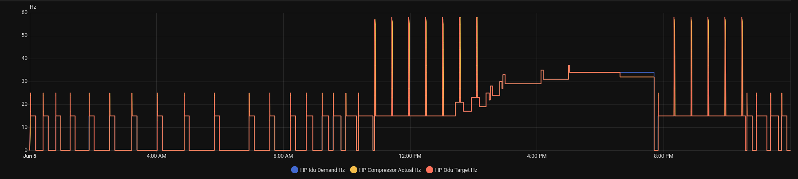

Midea S1S2 Bus Simulator
========================
Replays LOW OUTPUT captured frames from a daily SQLite database over a 
TCP socket, reproducing the original bus timing as closely as possible.
This means 6 frames every 3 seconds vs 24 frames every 3 seconds.

How To Run
-----
 Must run in a seperate terminal window from main.py
 
  python3 simulator.py <database.db> [HHMM]

  <database.db>   Path to a daily telemetry database
  [HHMM]          Optional start time (e.g. 1430 to start from 2:30 PM)

The simulator listens on localhost:5555 and waits for a client (e.g. main.py
with --ip 127.0.0.1 --port 5555). Each time a client connects, it streams the
full database from the requested start time, then waits for the next connection.

Examples
------------
python3 simulator.py HeatModeSample.db 0321
- This will start at a defrost cycle
  
 python3 simulator.py CoolModeSample.db 1052
 - This will start at the begining of a 8 hour cycle which includes multiple oil returns and step searching for higher loads. See image below

Usage
------------
Option 1: 
nc 127.0.0.1 5555 | xxd -p
- This option prints raw hex frames to the terminal.

Option 2:
nc 127.0.0.1 5555 | python3 s1s2_monitor.py -f
- This is a standalone python monitor script that does not require any pip installs that has a Matrix themed animation and displays sensor data to the terminal and animates using sensor data.

Option 3:
main.py --ip 127.0.0.1 --port 5555
- This option is the midea-s1s2-rs485-monitor app. Make sure "nc 127.0.0.1 5555 | xxd -p" works first.

Frame format
------------
All frames are emitted as clean LL+8 bytes with no trailing padding:
  [A0][addr_hi][addr_lo][msg_id][LL][payload x LL][0x00][CRC_lo][CRC_hi]
This matches the output of the new FrameBuffer which strips padding itself.

Timing
------
  - Inter-frame gap within a cycle : FRAME_GAP_S  (default 0.10 s)
  - Between cycles                 : actual timestamp delta from the DB,
                                     minus the time spent transmitting,
                                     clamped to [0, MAX_CYCLE_GAP_S]

Cool Mode HZ
------
Reference for cool mode sample. More images on main [README](../../README.md)

[MIT License](LICENSE)
